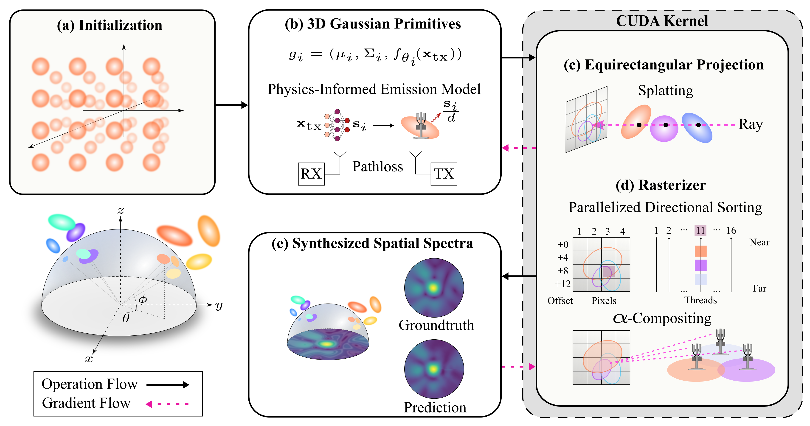
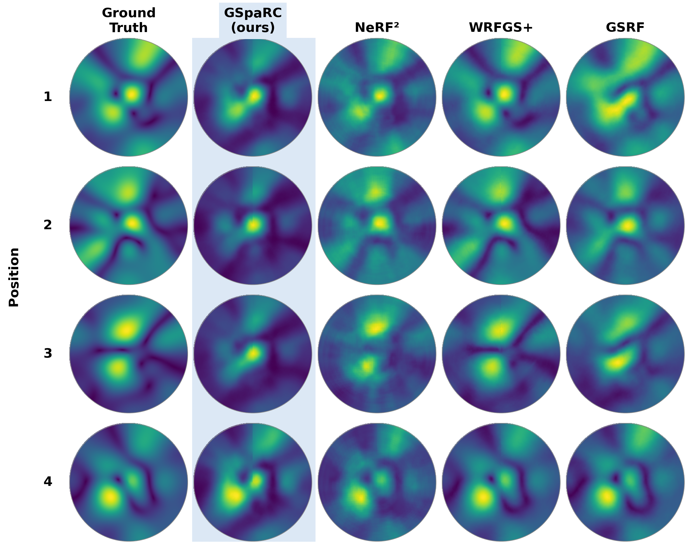

# GSpaRC: Gaussian Splatting for Real-time Reconstruction of RF Channels

This repository contains the reference implementation for the paper *"GSpaRC: Gaussian Splatting for Real-time Reconstruction of RF Channels"*.

- **Paper:** [arXiv:2511.22793](https://arxiv.org/abs/2511.22793)
- **Project website:** https://nbhavyasai.github.io/GSpaRC/
- **Datasets (HuggingFace):** [BhavyaN/gsparc-datasets](https://huggingface.co/datasets/BhavyaN/gsparc-datasets)



## Abstract

Channel state information (CSI) is essential for adaptive beamforming and maintaining robust links in wireless communication systems. However, acquiring CSI incurs significant overhead, consuming up to 25% of spectrum resources in 5G networks due to frequent pilot transmissions at millisecond-scale intervals. Recent approaches aim to reduce this burden by reconstructing CSI from spatiotemporal RF measurements, such as signal strength and direction-of-arrival. While effective in offline settings, these methods often suffer from inference latencies in the 5–100 ms range, making them impractical for real-time systems. We present **GSpaRC**, a method that achieves accurate channel reconstruction with latency in the low-millisecond regime or below. GSpaRC represents the RF environment using a compact set of 3D Gaussian primitives, each parameterized by a lightweight neural model augmented with physics-informed features such as distance-based attenuation. Unlike traditional vision-based splatting pipelines, GSpaRC is tailored for RF reception: it employs an equirectangular projection onto a hemispherical surface centered at the receiver to reflect omnidirectional antenna behavior. A custom CUDA pipeline enables fully parallelized directional sorting, splatting, and rendering across frequency and spatial dimensions. Evaluated on multiple RF datasets, GSpaRC achieves similar CSI reconstruction fidelity to recent state-of-the-art methods while reducing training and inference time by over an order of magnitude.



## Setup

### Conda environment

```bash
conda env create --file environment.yml
conda activate gsparc
```

Make sure `nvcc` from a CUDA toolkit that matches your PyTorch build is on `PATH` (e.g., CUDA 11.8 for `torch==2.x+cu118`):

```bash
export CUDA_HOME=/usr/local/cuda-11.8
export PATH=$CUDA_HOME/bin:$PATH
export LD_LIBRARY_PATH=$CUDA_HOME/lib64:$LD_LIBRARY_PATH
```

### Wireless CUDA Rasterizer

Build the custom CUDA rasterizer and the fused-SSIM kernel:

```bash
cd cuda_kernel_rasterize
pip install -e . --no-build-isolation
cd ../fused-ssim
pip install -e . --no-build-isolation
```

### Datasets

The Sionna conference-room dataset used in the paper is hosted on HuggingFace. To use it locally, download into `datasets/sionna/conference-room-mag/`:

```bash
mkdir -p datasets/sionna
hf download BhavyaN/gsparc-datasets \
    --repo-type dataset \
    --include "sionna_conference_room/*" \
    --local-dir datasets/sionna/_dl
mv datasets/sionna/_dl/sionna_conference_room datasets/sionna/conference-room-mag
rm -rf datasets/sionna/_dl
```

After this step the layout should be:

```
datasets/sionna/conference-room-mag/
├── gateway_info.yml
├── rx_pos.csv
├── spectrum/00001.npy … 05142.npy
├── train_index.txt
└── test_index.txt
```

For the RFID and Argos datasets, see the [HuggingFace dataset card](https://huggingface.co/datasets/BhavyaN/gsparc-datasets) — both link to their original public sources.

## Running

### Training

Train GSpaRC on the Sionna conference-room dataset:

```bash
python train.py \
    --mode train \
    --config configs/rfid-spectrum.yml \
    --dataset_type rfid \
    --gpu 0 \
    --checkpoint_interval 100000 \
    --debug
```

Checkpoints are saved under `results_*/run_*/checkpoints/` and TensorBoard logs under `results_*/run_*/tensorboard/`.

### Evaluation

Evaluate a trained checkpoint:

```bash
python train.py \
    --mode eval \
    --config configs/rfid-spectrum.yml \
    --dataset_type rfid \
    --gpu 0 \
    --load_checkpoint <path/to/checkpoint.pth> \
    --debug
```

The script writes per-sample metrics (SSIM, PSNR, MAE, confidence, render time) to `evaluation/per_sample_metrics_test.csv` and confidence-vs-loss diagnostic plots.

## Repository Layout

```
gspar/
├── train.py                 # training + evaluation entry point
├── gaussian.py              # Gaussian model + emission MLP + confidence MLP
├── renderer.py              # high-level renderer wrapper
├── preprocess_data.py       # dataset classes (Spectrum_dataset, CSI_Spectrum_dataset)
├── optimizer.py             # optimization hyperparameters
├── initialization.py        # initial Gaussian placement
├── plotting.py / utils.py   # logging + utilities
├── configs/                 # YAML configs (rfid-spectrum.yml is the Sionna setup)
├── cuda_kernel_rasterize/   # custom CUDA RF rasterizer
└── fused-ssim/              # fused SSIM kernel (training loss)
```

## Citation

```bibtex
@article{nukapotula2026gsparc,
  title   = {GSpaRC: Gaussian Splatting for Real-time Reconstruction of RF Channels},
  author  = {Nukapotula, Bhavya Sai and Tripathi, Rishabh and Pregler, Seth and Kalathil, Dileep and Shakkottai, Srinivas and Rappaport, Tedd},
  journal = {arXiv preprint arXiv:2511.22793},
  year    = {2026}
}
```

## License

Released under the MIT License — see `LICENSE` for details.
